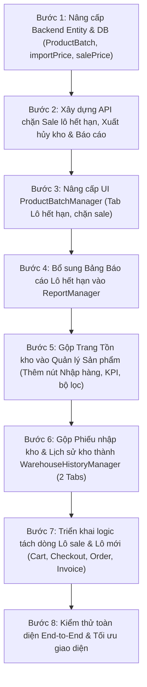

# I. PHÂN TÍCH HIỆN TRẠNG CODEBASE & BẢN CHẤT VẤN ĐỀ

1. **Về Lô & Hạn sử dụng (`ProductBatchManager` & `ProductBatch`)**:
   - Hiện tại bảng `product_batches` chỉ có `batch_name`, `quantity`, `expiry_date`, chưa có `import_price` (giá nhập nằm ở `goods_receipt_items`).
   - Tính năng "Thiết lập Sale" hiện tại đang gán đè `salePrice` lên toàn bộ thực thể `Product` chứ chưa hỗ trợ sale theo từng lô riêng lẻ.
   - Các lô đã quá hạn (`expiryDate < now()`) vẫn đang hiển thị nút "Thiết lập Sale", điều này sai nghiệp vụ vì hàng hết hạn **bắt buộc không được phép bán hoặc khuyến mãi** mà phải chuyển sang quy trình xuất hủy/trả hàng.
   - Module Báo cáo (`ReportManager` & `ReportService`) mới chỉ có báo cáo Doanh thu, Đơn hàng, Shipper, Top sản phẩm bán chạy, **chưa có bảng báo cáo tổn thất do lô hàng hết hạn**.

2. **Về Trang Tồn kho (`InventoryManager`) & Sản phẩm (`ProductManager`)**:
   - Bảng Sản phẩm (`ProductManager`) thực tế đã hiển thị cột số lượng tồn kho (`prod.currentStock`). Việc tách thêm một trang Tồn kho riêng (`InventoryManager`) làm cho menu bị cồng kềnh, thủ kho phải chuyển qua lại giữa 2 trang.
   - Nút "Tạo phiếu nhập kho" đang nằm ở trang Tồn kho, trong khi thủ kho khi xem danh sách sản phẩm thiếu hàng lại có nhu cầu bấm "Nhập hàng" ngay lập tức.

3. **Về Lịch sử Kho (`InventoryLedgerManager`) & Phiếu nhập kho (`GoodsReceiptManager`)**:
   - Hai trang này đang chiếm 2 mục riêng biệt trên thanh Sidebar. Về bản chất nghiệp vụ kho vận (WMS), cả hai đều là lịch sử chứng từ và biến động kho (một bên là Lịch sử phiếu nhập hàng, một bên là Sổ cái biến động kho xuất/nhập/bán/hủy). Gộp chung thành 1 danh mục có 2 Tab sẽ tinh gọn thanh điều hướng và tiện theo dõi.

4. **Về Xử lý Hết hạn theo Lô (1 Lô cận date đang Sale + 1 Lô mới nguyên giá)**:
   - **Thực tế siêu thị**: Cửa hàng nhập Lô 1 (còn 3 hộp, sắp hết hạn) muốn sale 50% để xả nhanh (ví dụ 5.000đ). Cùng lúc đó có Lô 2 mới nhập (còn 20 hộp, date dài) bán giá gốc 10.000đ.
   - **Vấn đề**: Khi khách chọn mua 5 hộp:
     - 3 hộp lấy từ Lô 1 (giá sale 5.000đ).
     - 2 hộp lấy từ Lô 2 (giá gốc 10.000đ).
   - **Giải pháp**: Cần có cơ chế định giá theo Lô, thuật toán FIFO tự động phân bổ số lượng, cảnh báo thông minh ở bước Giỏ hàng/Checkout và **tách riêng biệt 2 dòng trên Hóa đơn thanh toán**.

---

# II. GIẢI PHÁP KỸ THUẬT CHO TỪNG YÊU CẦU

```
┌──────────────────────────────────────────────────────────────────────────────────────────────────┐
│                               KIẾN TRÚC GIẢI PHÁP ĐỀ XUẤT                                       │
├────────────────────────────────┬────────────────────────────────┬────────────────────────────────┤
│ 1. LÔ HẾT HẠN & BÁO CÁO        │ 2. TINH GỌN MENU & QUẢN LÝ KHO │ 3. BÁN HÀNG THEO LÔ SALE/MỚI   │
├────────────────────────────────┼────────────────────────────────┼────────────────────────────────┤
│ • Chặn nút Sale lô hết hạn     │ • Gộp Tồn kho vào Sản phẩm     │ • Thiết lập giá Sale theo Lô   │
│ • Tab "Lô hết hạn" (SL, Vốn)   │ • Nút "Nhập hàng" tại SP       │ • Tự động tính số lượng sale/thường│
│ • Nút "Xuất hủy kho" ghi sổ    │ • Gộp Phiếu nhập & Sổ cái kho  │ • Cảnh báo trước khi thanh toán│
│ • Báo cáo tổn thất hết hạn     │   thành 1 mục (2 Tabs)         │ • Hóa đơn tách 2 dòng rõ ràng  │
└────────────────────────────────┴────────────────────────────────┴────────────────────────────────┘
```

### 1. Quản lý Lô hết hạn, Chặn Sale và Báo cáo tổn thất
- **Database & Backend**:
  - Bổ sung trường `importPrice` (hoặc tính từ `GoodsReceiptItem`) vào `ProductBatch` để lưu vết giá nhập của chính lô đó.
  - Khi người dùng gửi yêu cầu thiết lập Sale, kiểm tra điều kiện: `if (batch.getExpiryDate().isBefore(LocalDate.now())) throw new BadRequestException("Lô hàng đã hết hạn sử dụng, không được phép thiết lập Sale bán hàng!");`.
  - Thêm API xuất hủy lô hết hạn: trừ số lượng lô về 0, trừ `currentStock` của `inventory`, đồng thời ghi vào `inventory_ledger` loại `EXPIRED_DISPOSAL` ("Xuất hủy lô quá hạn sử dụng").
  - Thêm API Báo cáo: `/api/admin/reports/expired-batches` thống kê: Tổng số lượng hết hạn, Tổng giá trị vốn tổn thất (VND), danh sách chi tiết các lô bị hủy/quá hạn.
- **Frontend**:
  - Tại [`ProductBatchManager.jsx`](file:///d:/NAM%20CUOI/CNJAVA/DOAN_CNJAVA_MINI_MARKET-main/frontend/src/pages/admin/ProductBatchManager.jsx):
    - Thêm Tab thứ 3: **"Lô hàng đã hết hạn"** (hiển thị badge đỏ đếm số lượng). Các lô có `expiryDate < now()` sẽ tự động chuyển sang tab này.
    - Tại tab này, hiển thị rõ: **Số lượng tồn bị hết hạn**, **Đơn giá nhập**, **Tổng giá nhập thiệt hại** (`quantity * importPrice`), và nút **"Xuất hủy kho"**.
    - Ẩn hoàn toàn nút "Thiết lập Sale" với các lô đã hết hạn, thay bằng nhãn đỏ cảnh báo.
  - Tại [`ReportManager.jsx`](file:///d:/NAM%20CUOI/CNJAVA/DOAN_CNJAVA_MINI_MARKET-main/frontend/src/pages/admin/ReportManager.jsx):
    - Thêm 1 bảng báo cáo mới: **"Báo Cáo Thất Thoát Hàng Hết Hạn"** gồm Card KPI tổn thất vốn, bảng chi tiết theo từng lô, hỗ trợ xuất CSV và In báo cáo chứng từ.

### 2. Gộp Trang Tồn kho vào Quản lý Sản phẩm
- **Frontend**:
  - Trên Sidebar ([`AdminLayout.jsx`](file:///d:/NAM%20CUOI/CNJAVA/DOAN_CNJAVA_MINI_MARKET-main/frontend/src/layouts/AdminLayout.jsx)): Bỏ mục `Tồn kho`. Định tuyến `/admin/inventory` sẽ tự động redirect về `/admin/products`.
  - Nâng cấp [`ProductManager.jsx`](file:///d:/NAM%20CUOI/CNJAVA/DOAN_CNJAVA_MINI_MARKET-main/frontend/src/pages/admin/ProductManager.jsx):
    - Thêm nút hành động nhanh **"Tạo phiếu nhập hàng"** (`+ Nhập hàng`) màu xanh nổi bật ngay trên thanh công cụ header, bấm vào là chuyển thẳng tới form lập phiếu nhập kho.
    - Thêm 3 thẻ KPI nhanh ở đầu trang: **Tổng lượng tồn kho**, **Mặt hàng sắp hết (< tối thiểu)**, **Mặt hàng đã hết (tồn = 0)** (bấm vào thẻ nào sẽ lọc ngay sản phẩm theo trạng thái đó).
    - Bổ sung bộ lọc trạng thái tồn kho: `Tất cả` | `Còn hàng` | `Sắp hết hàng` | `Hết hàng`.

### 3. Gộp Lịch sử Nhập kho & Lịch sử kho thành 1 Danh mục (2 Tabs)
- **Frontend**:
  - Tạo trang hợp nhất [`WarehouseHistoryManager.jsx`](file:///d:/NAM%20CUOI/CNJAVA/DOAN_CNJAVA_MINI_MARKET-main/frontend/src/pages/admin/):
    - **Tab 1: Phiếu nhập kho** (Kế thừa toàn bộ chức năng của [`GoodsReceiptManager.jsx`](file:///d:/NAM%20CUOI/CNJAVA/DOAN_CNJAVA_MINI_MARKET-main/frontend/src/pages/admin/GoodsReceiptManager.jsx): Lập phiếu, duyệt phiếu, in phiếu nhập).
    - **Tab 2: Sổ cái biến động kho** (Kế thừa toàn bộ chức năng của [`InventoryLedgerManager.jsx`](file:///d:/NAM%20CUOI/CNJAVA/DOAN_CNJAVA_MINI_MARKET-main/frontend/src/pages/admin/InventoryLedgerManager.jsx): Theo dõi xuất/nhập/bán/hủy, tồn trước, tồn sau, in sổ cái).
  - Cập nhật Sidebar: Đổi 2 mục cũ thành 1 mục duy nhất: **"Lịch sử & Nhập kho"** (`/admin/warehouse-history`).

### 4. Giải pháp Bán hàng & Hết hạn theo Lô (Xử lý 1 Lô cận date Sale + 1 Lô mới)
- **Cơ chế tính toán**:
  - Mỗi `ProductBatch` được lưu trường `salePrice` riêng biệt.
  - Khi khách mua số lượng $N$ sản phẩm:
    - Hệ thống duyệt các lô còn hạn theo thứ tự `expiryDate ASC` (FIFO).
    - Giả sử Lô cận date có giá sale là $P_{sale}$ và còn tồn $Q_{sale}$. Lô mới có giá gốc $P_{gốc}$.
    - **Trường hợp $N \le Q_{sale}$**: Toàn bộ $N$ sản phẩm tính theo giá $P_{sale}$.
    - **Trường hợp $N > Q_{sale}$**:
      - $Q_{sale}$ sản phẩm được tính giá ưu đãi xả kho $P_{sale}$.
      - $(N - Q_{sale})$ sản phẩm vượt quá số lượng lô sale sẽ lấy từ lô mới và tính theo giá gốc $P_{gốc}$.
- **Giao diện Khách hàng (Giỏ hàng & Checkout)**:
  - Khi số lượng vượt quá số lượng của lô đang sale, hiển thị khung thông báo nổi bật màu vàng:
    > ℹ️ **Lưu ý giá theo lô**: Sản phẩm **[Tên SP]** chỉ còn **{Q_sale}** sản phẩm thuộc lô cận date giá ưu đãi **{P_sale}đ**. **{N - Q_sale}** sản phẩm còn lại được tính theo giá gốc **{P_gốc}đ** của lô mới.
  - Bảng tổng kết đơn hàng hiển thị tách thành 2 dòng riêng để khách nắm rõ số tiền.
- **Tạo đơn hàng & Hóa đơn (`OrderService` & `InvoiceManager`)**:
  - Hệ thống tạo 2 bản ghi `OrderItem`:
    - Dòng 1: `[Tên SP] (Xả kho cận date - HSD: ...)`, Đơn giá: $P_{sale}$, Số lượng: $Q_{sale}$.
    - Dòng 2: `[Tên SP] (Lô tiêu chuẩn)`, Đơn giá: $P_{gốc}$, Số lượng: $N - Q_{sale}$.
  - Trừ kho chính xác vào từng `ProductBatch` theo FIFO.
  - **Trên Hóa đơn in ra (`InvoiceManager`)**: Hiển thị tách biệt rõ ràng 2 dòng: phần sản phẩm sale và phần sản phẩm không sale, minh bạch 100% về giá trị đơn hàng, không xảy ra tranh chấp.

---

# III. KẾ HOẠCH TRIỂN KHAI (IMPLEMENTATION PLAN)

Dưới đây là các bước thực hiện tuần tự để hoàn thiện toàn bộ yêu cầu:



### Bước 1: Nâng cấp Model & Database
- Cập nhật [`ProductBatch.java`](file:///d:/NAM%20CUOI/CNJAVA/DOAN_CNJAVA_MINI_MARKET-main/src/main/java/com/groceryshop/entity/ProductBatch.java): thêm `importPrice`, `salePrice`, `status`.
- Cập nhật [`GoodsReceiptService.java`](file:///d:/NAM%20CUOI/CNJAVA/DOAN_CNJAVA_MINI_MARKET-main/src/main/java/com/groceryshop/service/GoodsReceiptService.java): gán `importPrice` khi hoàn thành phiếu nhập kho sang các batch mới tạo.
- Cập nhật [`ProductBatchDTO.java`](file:///d:/NAM%20CUOI/CNJAVA/DOAN_CNJAVA_MINI_MARKET-main/src/main/java/com/groceryshop/dto/ProductBatchDTO.java) & [`EntityMapper.java`](file:///d:/NAM%20CUOI/CNJAVA/DOAN_CNJAVA_MINI_MARKET-main/src/main/java/com/groceryshop/mapper/EntityMapper.java).

### Bước 2: Viết Backend API cho Lô hết hạn & Báo cáo
- Cập nhật [`ProductBatchService.java`](file:///d:/NAM%20CUOI/CNJAVA/DOAN_CNJAVA_MINI_MARKET-main/src/main/java/com/groceryshop/service/ProductBatchService.java):
  - Phương thức `getExpiredBatches()`: Lấy các lô có `expiryDate < now()`.
  - Kiểm tra chặn trong `applyClearanceSale()`: Ném lỗi nếu lô đã hết hạn.
  - Phương thức `disposeBatch(Long batchId, Long userId)`: Xuất hủy lô hết hạn, trừ kho và ghi sổ cái `InventoryLedger`.
- Cập nhật [`ReportService.java`](file:///d:/NAM%20CUOI/CNJAVA/DOAN_CNJAVA_MINI_MARKET-main/src/main/java/com/groceryshop/service/ReportService.java) & [`ReportController.java`](file:///d:/NAM%20CUOI/CNJAVA/DOAN_CNJAVA_MINI_MARKET-main/src/main/java/com/groceryshop/controller/ReportController.java): Thêm endpoint `/api/admin/reports/expired-batches`.

### Bước 3: Nâng cấp Giao diện Quản lý Lô hàng (`ProductBatchManager.jsx`)
- Thêm Tab **"Lô hàng đã hết hạn"** bên cạnh 2 tab hiện tại.
- Ẩn nút "Thiết lập Sale" với các lô hết hạn.
- Hiển thị thông tin: Số lượng hết hạn, Giá nhập, Tổng giá nhập bị mất (`quantity * importPrice`).
- Thêm nút "Xuất hủy kho" để trừ kho hợp lệ.

### Bước 4: Thêm Báo cáo Lô hết hạn vào `ReportManager.jsx`
- Thêm thẻ KPI tổn thất vốn do hết hạn.
- Bổ sung bảng chi tiết danh sách lô hết hạn kèm tính năng Xuất CSV và In báo cáo.

### Bước 5: Gộp Trang Tồn kho vào `ProductManager.jsx`
- Đưa nút `+ Nhập hàng` lên header trang Quản lý sản phẩm.
- Bổ sung thanh KPI tồn kho (Tổng tồn, Sắp hết, Hết hàng) và bộ lọc theo trạng thái tồn.
- Xóa mục `Tồn kho` ở Sidebar [`AdminLayout.jsx`](file:///d:/NAM%20CUOI/CNJAVA/DOAN_CNJAVA_MINI_MARKET-main/frontend/src/layouts/AdminLayout.jsx), tạo redirect tự động.

### Bước 6: Gộp Lịch sử kho & Phiếu nhập kho (`WarehouseHistoryManager.jsx`)
- Tạo component `WarehouseHistoryManager.jsx` tích hợp cả 2 tab:
  - Tab 1: Phiếu nhập kho (tạo phiếu, danh sách, chi tiết).
  - Tab 2: Sổ cái biến động kho.
- Cập nhật menu Sidebar thành 1 mục duy nhất: "Lịch sử & Nhập kho".

### Bước 7: Xử lý Bán hàng theo Lô (Cart, Checkout, Order, Invoice)
- Bổ sung API preview giá giỏ hàng theo lô: kiểm tra số lượng lô sale so với số lượng khách chọn.
- Tại `Cart.jsx` & `Checkout.jsx`: Hiển thị thông báo khi số lượng vượt quá lô sale, tách rõ 2 dòng (lô sale và lô mới).
- Tại `OrderService.java`: Tách 2 dòng `OrderItem` tương ứng khi lưu đơn hàng và trừ tồn kho chính xác theo từng lô.
- Tại `InvoiceManager.jsx` & mẫu in hóa đơn: Tách rõ ràng 2 phần sản phẩm sale và không sale.

### Bước 8: Kiểm thử & Nghiệm thu
- Kiểm thử luồng nhập kho tạo lô có giá nhập.
- Kiểm thử chặn thiết lập sale khi lô quá hạn.
- Kiểm thử luồng mua hàng vượt quá số lượng lô sale -> kiểm tra cảnh báo -> kiểm tra hóa đơn in ra.
- Kiểm tra tính toán báo cáo tổn thất vốn do hết hạn.

