# TỔNG HỢP TOÀN BỘ QUY TRÌNH NGHIỆP VỤ HỆ THỐNG SIÊU THỊ TIỆN LỢI MINIMART

**Dự án**: Siêu thị tiện lợi MiniMart (Hệ thống Bán hàng Đa kênh & Điều phối Giao hàng)  
**Công nghệ**: Backend Java Spring Boot 3 + Frontend React Vite  
**Cơ sở dữ liệu**: SQL Server / JPA Hibernate  
**Tài liệu chuẩn hóa**: Quy trình nghiệp vụ thuần túy (Business Process Management - BPM)  

---

## MỤC LỤC TỔNG QUAN

1. [PHẦN I: CÁC VAI TRÒ VÀ TÁC NHÂN TRONG HỆ THỐNG (SYSTEM ACTORS)](#phần-i-các-vai-trò-và-tác-nhân-trong-hệ-thống)
2. [PHẦN II: CÁC QUY TRÌNH NGHIỆP VỤ LỚN TOÀN TRÌNH (CORE END-TO-END WORKFLOWS)](#phần-ii-các-quy-trình-nghiệp-vụ-lớn-toàn-trình)
   - [2.1. Quy trình Mua hàng & Đặt hàng Toàn trình (Customer Shopping & Checkout)](#21-quy-trình-mua-hàng--đặt-hàng-toàn-trình)
   - [2.2. Quy trình Xử lý, Duyệt đơn & Điều phối Giao hàng Đa khu vực (Order Fulfillment & Dispatch)](#22-quy-trình-xử-lý-duyệt-đơn--điều-phối-giao-hàng-đa-khu-vực)
   - [2.3. Quy trình Nhập kho & Kiểm định Chất lượng Lô hàng Hạn dùng (Goods Receipt & QC Lifecycle)](#23-quy-trình-nhập-kho--kiểm-định-chất-lượng-lô-hàng-hạn-dùng)
   - [2.4. Quy trình Bán hàng Đa lô, Xả kho Cận Date & Xuất hủy Hàng hết hạn (Batch Clearance & Disposal)](#24-quy-trình-bán-hàng-đa-lô-xả-kho-cận-date--xuất-hủy-hàng-hết-hạn)
   - [2.5. Quy trình Khách hàng Thân thiết, Tích lũy Điểm & Thăng hạng Hội viên (Loyalty Tiering)](#25-quy-trình-khách-hàng-thân-thiết-tích-lũy-điểm--thăng-hạng-hội-viên)
3. [PHẦN III: CÁC QUY TRÌNH NGHIỆP VỤ THEO TỪNG PHÂN HỆ CHỨC NĂNG (SUB-PROCESSES BY MODULE)](#phần-iii-các-quy-trình-nghiệp-vụ-theo-từng-phân-hệ-chức-năng)
   - [3.1. Phân hệ Quản lý Thương hiệu (Brand Management)](#31-phân-hệ-quản-lý-thương-hiệu-brand-management)
   - [3.2. Phân hệ Quản lý Danh mục Ngành hàng (Category Management)](#32-phân-hệ-quản-lý-danh-mục-ngành-hàng-category-management)
   - [3.3. Phân hệ Quản lý Nhà cung cấp Đối tác (Supplier Management)](#33-phân-hệ-quản-lý-nhà-cung-cấp-đối-tác-supplier-management)
   - [3.4. Phân hệ Quản lý Mặt hàng & Thư viện Hình ảnh (Product Management)](#34-phân-hệ-quản-lý-mặt-hàng--thư-viện-hình-ảnh-product-management)
   - [3.5. Phân hệ Quản lý Tồn kho & Sổ cái Biến động Kho (Inventory & Stock Ledger)](#35-phân-hệ-quản-lý-tồn-kho--sổ-cái-biến-động-kho-inventory--ledger)
   - [3.6. Phân hệ Quản lý Mã Giảm Giá & Chiến dịch Khuyến mãi (Coupon Management)](#36-phân-hệ-quản-lý-mã-giảm-giá--chiến-dịch-khuyến-mãi-coupon-management)
   - [3.7. Phân hệ Quản lý Cấu hình & Đối soát Thanh toán (Payment Management)](#37-phân-hệ-quản-lý-cấu-hình--đối-soát-thanh-toán-payment-management)
   - [3.8. Phân hệ Quản lý Đánh giá & Phản hồi Khách hàng (Review Management)](#38-phân-hệ-quản-lý-đánh-giá--phản-hồi-khách-hàng-review-management)
   - [3.9. Phân hệ Hỗ trợ Trực tuyến & Trợ lý Ảo Thông minh (Support & AI Bot)](#39-phân-hệ-hỗ-trợ-trực-tuyến--trợ-lý-ảo-thông-minh-support--ai-bot)
   - [3.10. Phân hệ Quản lý Tài khoản & Phân quyền Người dùng (User & Security)](#310-phân-hệ-quản-lý-tài-khoản--phân-quyền-người-dùng-user--security)
   - [3.11. Phân hệ Báo cáo Thống kê & Phân tích Hoạt động Kinh doanh (Analytics & Reports)](#311-phân-hệ-báo-cáo-thống-kê--phân-tích-hoạt-động-kinh-doanh-analytics--reports)

---

## PHẦN I: CÁC VAI TRÒ VÀ TÁC NHÂN TRONG HỆ THỐNG

| Vai trò / Tác nhân | Ký hiệu phân quyền | Trách nhiệm và Quyền hạn chính |
| :--- | :---: | :--- |
| **Khách hàng** | `ROLE_USER` | Tìm kiếm, xem hàng hóa, chọn mua, áp dụng voucher khuyến mãi, thanh toán (tiền mặt COD hoặc chuyển khoản QR/MoMo), tra cứu hành trình đơn hàng, xem điểm tích lũy và hưởng đặc quyền hạng thành viên, đánh giá chất lượng sản phẩm, nhắn tin hỗ trợ. |
| **Nhân viên Giao hàng (Shipper)** | `ROLE_SHIPPER` | Nhận danh sách đơn hàng được điều phối tự động theo quận phụ trách (Tân Phú, Tân Bình, Quận 12...), cập nhật trạng thái đang giao, liên hệ khách hàng, giao hàng tận tay, thu tiền COD và cập nhật kết quả giao hàng. |
| **Quản trị viên / Quản lý Kho** | `ROLE_ADMIN` | Quản lý toàn bộ danh mục ngành hàng, nhãn hàng, nhà cung cấp, thông tin sản phẩm; lập phiếu nhập kho và kiểm định chất lượng hàng hóa; quản lý các lô hàng cận date và tiêu hủy hàng hết hạn; duyệt đơn hàng và điều phối giao hàng; cấu hình tài khoản thanh toán; duyệt đánh giá; xem báo cáo doanh thu và tổn thất kho. |

---

## PHẦN II: CÁC QUY TRÌNH NGHIỆP VỤ LỚN TOÀN TRÌNH

---

### 2.1. Quy trình Mua hàng & Đặt hàng Toàn trình (Customer Shopping & Checkout)

#### 1. Mô tả chi tiết quy trình:
1. **Tìm kiếm và Chọn hàng**: Khách hàng xem danh mục, tìm kiếm theo từ khóa hoặc xem các mặt hàng xả kho cận date giá ưu đãi.
2. **Thêm vào Giỏ hàng**: Khách chọn số lượng. Hệ thống kiểm tra số lượng tồn kho khả dụng; nếu còn đủ hàng, hệ thống cập nhật mặt hàng vào giỏ hàng của khách kèm thông tin lô sale (nếu có).
3. **Tiến hành Đặt hàng (Checkout)**: Khách mở trang thanh toán. Hệ thống tải sổ địa chỉ nhận hàng và danh sách các phương thức thanh toán đang hoạt động.
4. **Áp dụng Mã giảm giá (Coupon)**: Khách nhập mã voucher. Hệ thống kiểm tra 6 điều kiện (thời hạn, trạng thái kích hoạt, số lượt còn lại, giá trị đơn tối thiểu, ngành hàng áp dụng, giới hạn giảm tối đa) và tính ra số tiền được giảm trừ.
5. **Khấu trừ Đặc quyền Hạng Hội viên**: Hệ thống tự động kiểm tra hạng thành viên của khách để cộng thêm mức chiết khấu tri ân:
   * Hạng Bạc: Giảm thêm 2% tổng tiền hàng.
   * Hạng Vàng: Giảm thêm 5% tổng tiền hàng.
   * Hạng Kim Cương: Giảm thêm 8% tổng tiền hàng.
6. **Xác nhận Đặt hàng & Trừ kho Thông minh**:
   * Khách chọn hình thức thanh toán (Tiền mặt khi nhận COD, Chuyển khoản VietQR, hoặc Ví điện tử MoMo) và bấm "Đặt hàng".
   * Hệ thống tự động phân bổ trừ tồn kho theo nguyên tắc **Nhập trước - Xuất trước (FIFO)**: Ưu tiên trừ hết số lượng trong lô cận date giá rẻ trước; phần còn lại trừ tiếp vào lô tiêu chuẩn (nếu mua vượt số lượng sale thì tách thành 2 dòng rõ ràng trên đơn hàng).
   * Hệ thống trừ tổng tồn kho của sản phẩm, ghi sổ cái nhật ký kho loại "Xuất bán hàng", cập nhật lượt dùng mã giảm giá, khởi tạo đơn hàng ở trạng thái **"Chờ xác nhận"** và làm sạch giỏ hàng.
7. **Phản hồi Khách hàng**: Trả về màn hình xác nhận đặt hàng thành công với đầy đủ mã đơn hàng, bảng kê hàng hóa, số tiền thực trả và mã QR quét thanh toán (nếu chọn chuyển khoản).

#### 2. Sơ đồ Mermaid:
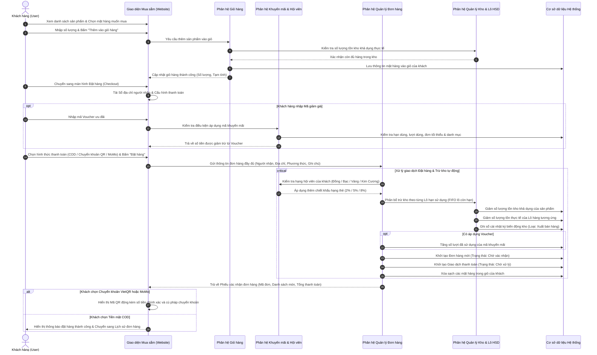

---

### 2.2. Quy trình Xử lý, Duyệt đơn & Điều phối Giao hàng Đa khu vực (Order Fulfillment & Dispatch)

#### 1. Mô tả chi tiết quy trình:
1. **Tiếp nhận & Kiểm tra Đơn**: Đơn hàng mới vào hệ thống ở trạng thái **"Chờ xác nhận"**. Quản trị viên mở bảng quản lý đơn hàng để kiểm tra tính chính xác của địa chỉ và hàng hóa.
2. **Xử lý Duyệt đơn hoặc Hủy đơn**:
   * *Nếu hủy đơn*: Đơn chuyển sang **"Đã hủy"**, hệ thống tự động hoàn trả số lượng hàng về đúng lô ban đầu, hoàn trả tồn kho, ghi sổ cái kho loại "Hoàn trả hàng hủy", hoàn trả lượt dùng voucher và hủy giao dịch thanh toán.
   * *Nếu duyệt đơn*: Đơn chuyển sang **"Đã xác nhận"**. Hệ thống tự động xác nhận thanh toán: nếu là đơn COD thì đổi thành "Đã duyệt COD", nếu là chuyển khoản đã nhận được tiền thì đổi thành "Đã thanh toán".
3. **Điều phối Giao hàng theo Địa bàn**:
   * *Cơ chế tự động theo khu vực*: Hệ thống phân tích chuỗi địa chỉ giao hàng của khách để nhận diện quận huyện:
     * Địa chỉ thuộc **Quận Tân Phú** $\rightarrow$ Tự động phân bổ cho Shipper số 1.
     * Địa chỉ thuộc **Quận Tân Bình** $\rightarrow$ Tự động phân bổ cho Shipper số 2.
     * Địa chỉ thuộc **Quận 12** $\rightarrow$ Tự động phân bổ cho Shipper số 3.
   * *Cơ chế phân bổ thủ công*: Quản trị viên có thể chọn từng đơn hoặc chọn hàng loạt đơn chưa gán để giao cho một shipper tùy ý.
   * Đơn hàng sau khi phân bổ chuyển sang trạng thái **"Đã nhận đơn"**.
4. **Quy trình Giao nhận của Shipper**:
   * Shipper mở ứng dụng, xem danh sách đơn hàng được giao, thông tin người nhận, lộ trình và số tiền cần thu.
   * Shipper bấm **"Bắt đầu giao"** $\rightarrow$ Đơn hàng đổi sang trạng thái **"Đang giao hàng"**.
   * Đến địa chỉ, shipper liên hệ người nhận và giao hàng thực tế.
5. **Cập nhật Kết quả Giao hàng**:
   * *Trường hợp giao thất bại* (khách không nghe máy, từ chối nhận): Shipper nhập lý do thất bại và xác nhận $\rightarrow$ Đơn chuyển sang trạng thái **"Giao thất bại"** để quản trị viên liên hệ lại hoặc điều phối lại cho shipper khác (`reassign`).
   * *Trường hợp giao thành công*: Shipper nhận tiền mặt (nếu đơn COD) và bấm "Giao thành công" $\rightarrow$ Đơn chuyển sang trạng thái **"Đã giao hàng"**, giao dịch thanh toán COD chuyển thành "Đã thanh toán".
6. **Hoàn tất Đơn hàng & Tích điểm Thăng hạng**: Quản trị viên kiểm tra và bấm "Hoàn thành đơn" $\rightarrow$ Đơn chuyển sang **"Hoàn thành"**, hệ thống tự động tính điểm tích lũy cho khách hàng (1 điểm / 100.000đ) và tự động nâng hạng thẻ nếu đủ điều kiện.

#### 2. Sơ đồ Mermaid:
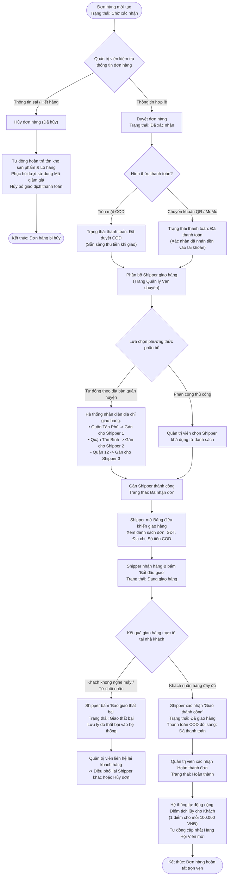

---

### 2.3. Quy trình Nhập kho & Kiểm định Chất lượng Lô hàng Hạn dùng (Goods Receipt & QC Lifecycle)

#### 1. Mô tả chi tiết quy trình:
1. **Lập Phiếu Nhập Hàng**: Quản lý kho chọn Nhà cung cấp đối tác, Thương hiệu và danh sách mặt hàng cần nhập. Với mỗi mặt hàng, nhập số lượng dự kiến nhập, đơn giá nhập vốn, mã số lô sản xuất và hạn sử dụng (HSD). Phiếu được lưu ở trạng thái **"Bản nháp (DRAFT)"**.
2. **Kiểm tra Thực tế tại Cửa kho**: Khi xe tải của nhà cung cấp giao hàng đến, nhân sự kho kiểm đếm thực tế. Hệ thống cung cấp 2 phương thức xử lý:
   * **Phương thức 1 - Hoàn thành nhanh (100% đạt chuẩn)**: Áp dụng khi hàng hóa nguyên đai nguyên kiện, không có hư hao. Toàn bộ số lượng nhập được ghi nhận đạt chuẩn.
   * **Phương thức 2 - Kiểm định Chất lượng (QC) Chuyên sâu**: Áp dụng khi cần kiểm tra tỉ mỉ hàng tươi sống, bánh kẹo, đồ hộp. Nhân viên nhập rõ số lượng đạt chuẩn (`passedQuantity`) và số lượng lỗi/hư hỏng/móp méo/cận date bị từ chối trả về nhà cung cấp (`rejectedQuantity`) kèm lý do cụ thể. Hệ thống kiểm tra điều kiện bắt buộc: `Số lượng đạt + Số lượng từ chối = Tổng số lượng nhập ban đầu`.
3. **Cập nhật Kho & Sinh Lô Hàng Tự Động**:
   * Phiếu nhập chuyển sang trạng thái **"Hoàn thành (COMPLETED)"**.
   * **Nguyên tắc an toàn dữ liệu**: Hệ thống **chỉ tăng số lượng tồn kho khả dụng đối với phần số lượng ĐẠT CHUẨN**.
   * Tự động khởi tạo bản ghi **Lô hàng mới** với đúng số lượng đạt chuẩn, gắn mã số lô, giá vốn nhập và hạn sử dụng để phục vụ bán lẻ.
   * Ghi nhận vào **Sổ cái nhật ký kho** loại "Nhập kho mua hàng" (đối với phần đạt chuẩn) và ghi nhận lý do trả hàng (đối với phần từ chối) để đối soát công nợ với nhà cung cấp.

#### 2. Sơ đồ Mermaid:
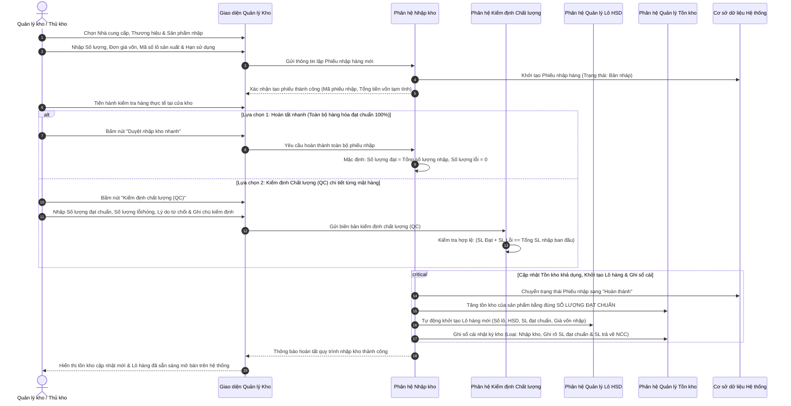

---

### 2.4. Quy trình Bán hàng Đa lô, Xả kho Cận Date & Xuất hủy Hàng hết hạn (Batch Clearance & Disposal)

#### 1. Mô tả chi tiết quy trình:
1. **Hệ thống Quét Hạn Sử Dụng Hàng Ngày**:
   * Hệ thống tự động so sánh ngày hết hạn của từng lô hàng với ngày hiện tại để phân loại thành 3 nhóm trạng thái:
     * **Lô hàng tiêu chuẩn**: Hạn sử dụng còn xa (> 30 ngày) $\rightarrow$ Bán với giá niêm yết chuẩn.
     * **Lô hàng cận date**: Hạn sử dụng còn trong vòng 30 ngày trở lại $\rightarrow$ Cảnh báo quản lý kho.
     * **Lô hàng đã hết hạn**: Hạn sử dụng nhỏ hơn ngày hôm nay $\rightarrow$ Tự động chuyển sang trạng thái hết hạn (`EXPIRED`).
2. **Nghiệp vụ Xả kho Cận Date (Clearance Sale)**:
   * Với các lô cận hạn, quản lý kho có thể kích hoạt chương trình "Xả kho cận date" bằng cách nhập phần trăm giảm giá (ví dụ: giảm 30%) hoặc nhập trực tiếp giá xả kho mong muốn (`salePrice < price`).
   * Hệ thống cập nhật giá sale riêng cho lô đó và hiển thị nổi bật trên website kèm hạn sử dụng cụ thể để khách hàng nắm rõ trước khi mua.
3. **Thuật toán Xuất bán Đa lô Thông minh (FIFO)**:
   * Khi khách hàng đặt mua mặt hàng có lô cận date:
     * Nếu khách mua **nhỏ hơn hoặc bằng** số lượng tồn của lô cận date: Toàn bộ mặt hàng được tính theo giá xả kho ưu đãi.
     * Nếu khách mua **vượt quá** số lượng tồn của lô cận date: Hệ thống tự động tách thành 2 dòng mặt hàng trên đơn hàng: dòng 1 là toàn bộ số lượng lô sale với giá ưu đãi, dòng 2 là phần số lượng còn thiếu lấy từ lô tiêu chuẩn với giá niêm yết chuẩn.
4. **Nghiệp vụ Khóa & Xuất hủy Hàng Hết Hạn**:
   * Đối với các lô đã quá hạn sử dụng: Hệ thống **khóa cứng**, cấm không cho thiết lập giảm giá và không bao giờ xuất bán cho khách hàng.
   * Các lô hết hạn được chuyển sang tab quản lý "Lô hàng hết hạn", hệ thống tự động tính toán tổng số tiền vốn bị thiệt hại (`Số lượng tồn x Giá vốn nhập`).
   * Quản lý kho thực hiện thao tác **"Xuất hủy kho"**: Số lượng tồn của lô đưa về 0, trạng thái lô chuyển sang "Đã xuất hủy (`DISPOSED`)", trừ tồn kho khả dụng của sản phẩm, ghi sổ cái kho loại "Xuất hủy hàng hết hạn" và tổng hợp số liệu vào Báo cáo tổn thất hàng hủy.

#### 2. Sơ đồ Mermaid:
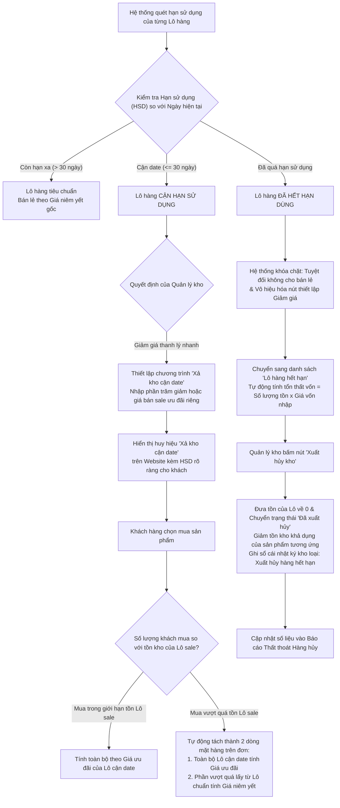

---

### 2.5. Quy trình Khách hàng Thân thiết, Tích lũy Điểm & Thăng hạng Hội viên (Loyalty Tiering)

#### 1. Mô tả chi tiết quy trình:
1. **Khởi tạo Tài khoản**: Khách hàng đăng ký tài khoản thành công mặc định bắt đầu ở hạng **Đồng (Bronze)** với 0 điểm tích lũy.
2. **Cơ chế Tích lũy Điểm**:
   * Khi khách mua hàng và đơn hàng được hoàn tất thành công (shipper giao hàng và thanh toán đầy đủ), hệ thống tự động quy đổi: **Mỗi 100.000 VNĐ thanh toán thực tế = Tích lũy 1 điểm**.
   * Điểm thưởng được cộng dồn lũy kế vào hồ sơ khách hàng.
3. **Tự động Thăng hạng & Đặc quyền tương ứng**:
   * **Hạng Đồng (`BRONZE` - Dưới 100 điểm)**: Quyền lợi cơ bản, tích lũy điểm thưởng theo đơn hàng.
   * **Hạng Bạc (`SILVER` - Từ 100 đến 499 điểm)**: Tự động chiết khấu 2% trực tiếp trên mọi đơn hàng tiếp theo; nhận voucher sinh nhật.
   * **Hạng Vàng (`GOLD` - Từ 500 đến 999 điểm)**: Tự động chiết khấu 5% trực tiếp trên mọi đơn hàng + Giảm 30% phí vận chuyển.
   * **Hạng Kim Cương (`DIAMOND` - Từ 1.000 điểm trở lên)**: Tự động chiết khấu tối đa 8% trực tiếp trên mọi đơn hàng + Miễn phí vận chuyển 100% không giới hạn.
4. **Theo dõi Trực quan trên Trang Cá nhân**: Khách hàng mở trang "Khách Hàng Thân Thiết" (`/loyalty`) để xem thẻ thành viên điện tử sang trọng, điểm khả dụng hiện có, thanh tiến trình % thăng hạng và kho mã giảm giá công khai đang phát hành.

#### 2. Sơ đồ Mermaid:
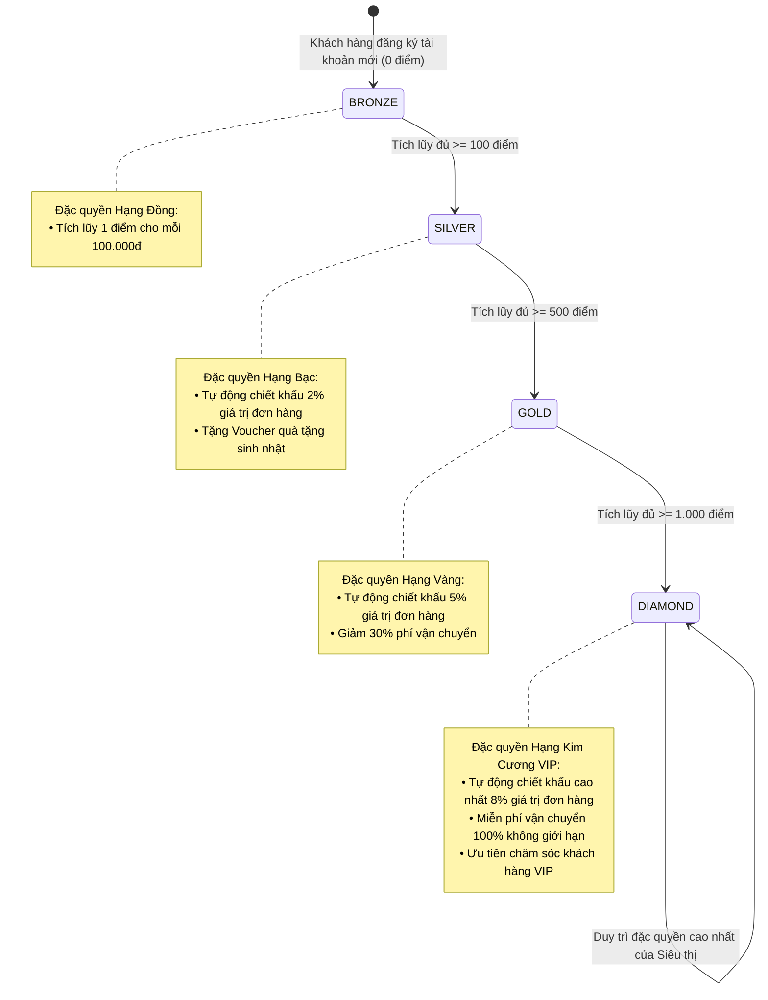

---

## PHẦN III: CÁC QUY TRÌNH NGHIỆP VỤ THEO TỪNG PHÂN HỆ CHỨC NĂNG

---

### 3.1. Phân hệ Quản lý Thương hiệu (Brand Management)

#### Mục đích:
Quản lý các nhãn hiệu, thương hiệu sản phẩm đối tác kinh doanh tại siêu thị (Vinamilk, TH True Milk, Coca-Cola, Pepsi, Acecook, Chinsu...).

#### Các quy trình con:
1. **Thêm mới thương hiệu**: Quản trị viên nhập Tên thương hiệu, Mô tả giới thiệu, Ảnh logo. Hệ thống kiểm tra tên không được trùng lặp. Mặc định kích hoạt trạng thái hoạt động.
2. **Chỉnh sửa thương hiệu**: Cập nhật thông tin mô tả, thay đổi ảnh logo hoặc đổi tên thương hiệu (kiểm tra không trùng với các thương hiệu khác).
3. **Bật/Tắt trạng thái hoạt động**: Tạm thời ẩn các thương hiệu tạm ngưng kinh doanh khỏi menu lọc của khách hàng.
4. **Xóa thương hiệu**: Kiểm tra ràng buộc toàn vẹn dữ liệu; nếu thương hiệu đã có sản phẩm thuộc về thì ngăn chặn xóa để bảo vệ lịch sử bán hàng.

#### Sơ đồ Mermaid:
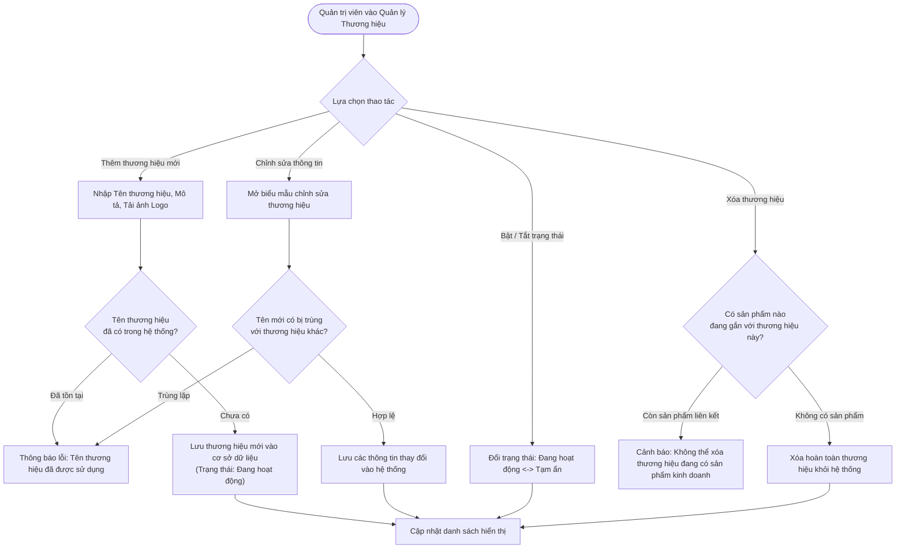

---

### 3.2. Phân hệ Quản lý Danh mục Ngành hàng (Category Management)

#### Mục đích:
Tổ chức cây phân loại mặt hàng trong siêu thị (Rau củ quả, Thịt cá tươi sống, Bánh kẹo & Đồ ăn vặt, Nước giải khát, Hóa mỹ phẩm, Gia vị...).

#### Các quy trình con:
1. **Thêm danh mục mới**: Nhập tên danh mục, mô tả tóm tắt, ảnh biểu tượng đại diện (Icon). Kiểm tra không trùng tên.
2. **Cập nhật danh mục**: Cho phép thay đổi tên hiển thị, ảnh biểu tượng và trạng thái hoạt động.
3. **Phân loại sản phẩm**: Phục vụ việc khách hàng duyệt lọc sản phẩm theo ngành hàng trên website và làm điều kiện giới hạn phạm vi áp dụng mã giảm giá.

#### Sơ đồ Mermaid:
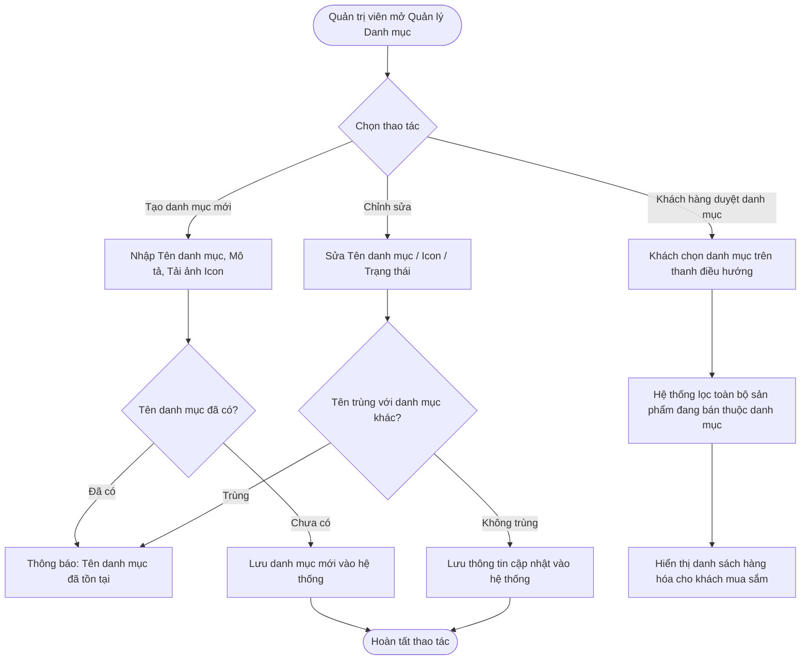

---

### 3.3. Phân hệ Quản lý Nhà cung cấp Đối tác (Supplier Management)

#### Mục đích:
Quản lý danh sách các tổng kho, công ty phân phối hàng sỉ cho siêu thị, thông tin liên lạc và theo dõi lịch sử cung ứng mặt hàng.

#### Các quy trình con:
1. **Thêm nhà cung cấp mới**: Nhập tên doanh nghiệp, người đại diện liên hệ, số điện thoại hotline, email công vụ, địa chỉ kho nhận hàng.
2. **Cập nhật hồ sơ đối tác**: Điều chỉnh số điện thoại, đổi địa chỉ kho xuất hàng hoặc người đại diện.
3. **Theo dõi danh mục hàng cung ứng**: Xem danh sách toàn bộ các sản phẩm đã từng nhập từ nhà cung cấp này, tổng số lượng đã cung cấp và ngày nhập hàng gần nhất.
4. **Bảo vệ dữ liệu lịch sử khi xóa**: Nếu nhà cung cấp đã từng có phiếu nhập kho phát sinh trong quá khứ, hệ thống ngăn cấm xóa vĩnh viễn, hướng dẫn chuyển trạng thái sang "Ngừng hợp tác" để bảo toàn chứng từ kế toán.

#### Sơ đồ Mermaid:
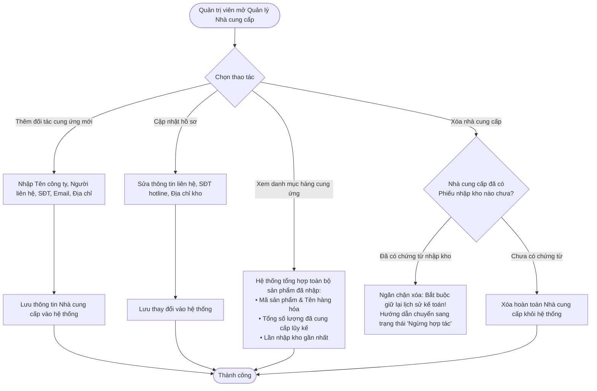

---

### 3.4. Phân hệ Quản lý Mặt hàng & Thư viện Hình ảnh (Product Management)

#### Mục đích:
Quản lý toàn bộ thông tin thương phẩm trưng bày và mở bán: Tên sản phẩm, Mã vạch Barcode, Mã quản lý SKU, Đơn vị tính (Chai, Lon, Gói, Hộp, Kg), Trọng lượng, Giá bán niêm yết, Giá bán ưu đãi chung, Danh mục, Thương hiệu và Thư viện ảnh chi tiết.

#### Các quy trình con:
1. **Tạo mới sản phẩm**:
   * Quản trị viên nhập thông tin chi tiết, chọn Danh mục và Thương hiệu liên kết, tải ảnh đại diện chính và các ảnh chụp góc cạnh.
   * **Khóa nhập tay số lượng tồn kho**: Hệ thống tự động khởi tạo bản ghi tồn kho với số lượng mặc định bằng 0. Số lượng tồn kho chỉ được phép gia tăng thông qua Phiếu Nhập Kho có kiểm định QC.
2. **Chỉnh sửa sản phẩm**: Điều chỉnh giá bán, sửa đổi mô tả chi tiết, bổ sung hoặc xóa ảnh thư viện. Hệ thống cấm chỉnh sửa số lượng tồn kho trực tiếp từ biểu mẫu này.
3. **Kích hoạt / Tạm ngừng kinh doanh**: Ẩn hoặc hiển thị lại sản phẩm trên website bán hàng.

#### Sơ đồ Mermaid:
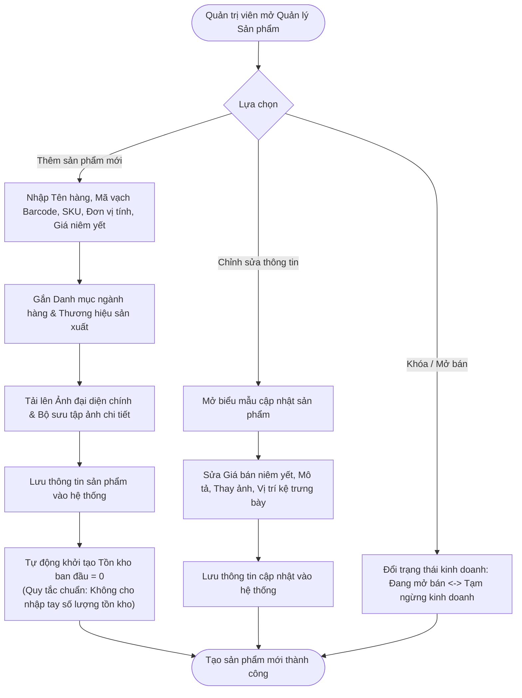

---

### 3.5. Phân hệ Quản lý Tồn kho & Sổ cái Biến động Kho (Inventory & Ledger)

#### Mục đích:
Theo dõi chính xác số lượng tồn kho của từng sản phẩm tại từng vị trí kệ hàng, cảnh báo hàng sắp hết và ghi vết toàn bộ lịch sử biến động kho phục vụ kiểm toán nội bộ.

#### Các quy trình con:
1. **Kiểm soát Tồn kho & Cảnh báo Tồn thấp**:
   * Hệ thống hiển thị danh sách tồn kho thực tế của tất cả mặt hàng.
   * Khi số lượng tồn thực tế nhỏ hơn hoặc bằng Ngưỡng an toàn tối thiểu (`minimumStock`), hệ thống tự động đưa vào danh mục "Cảnh báo tồn kho thấp" để thủ kho kịp thời lên kế hoạch nhập hàng.
   * Cập nhật vị trí kệ hàng (`location`) và điều chỉnh ngưỡng an toàn tối thiểu.
2. **Chặn Thao tác Can thiệp Tồn kho Trực tiếp**:
   * Chức năng cộng trừ tồn kho bằng tay bị khóa cứng. Mọi biến động bắt buộc phải gắn liền với chứng từ hợp lệ.
3. **Ghi vết Sổ cái Kho Tự động (Inventory Ledger)**:
   * **Nhập kho (`IMPORT`)**: Tự động ghi nhận số lượng tăng kèm mã phiếu nhập hàng.
   * **Bán lẻ (`SELL`)**: Tự động ghi nhận số lượng giảm kèm mã đơn hàng của khách.
   * **Hoàn trả (`RETURN`)**: Tự động ghi nhận số lượng bù hoàn kèm mã đơn hàng bị hủy.
   * **Xuất hủy (`EXPIRED_DISPOSAL`)**: Tự động ghi nhận số lượng trừ kèm mã lô hàng quá hạn và số tiền vốn bị tổn thất.

#### Sơ đồ Mermaid:
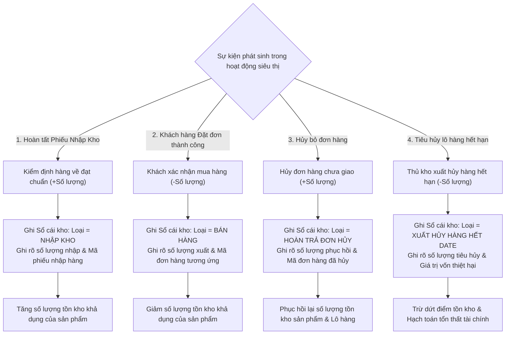

---

### 3.6. Phân hệ Quản lý Mã Giảm Giá & Chiến dịch Khuyến mãi (Coupon Management)

#### Mục đích:
Tạo và kiểm soát các mã khuyến mãi kích cầu tiêu dùng cho khách hàng thân thiết và khách hàng mới.

#### Các quy trình con:
1. **Tạo mới Chiến dịch Mã giảm giá**: Quản trị viên nhập mã code (viết hoa), tiêu đề ưu đãi, hình thức giảm (theo phần trăm % hoặc theo số tiền cố định), giá trị giảm, hạn mức giảm tối đa, giá trị đơn hàng tối thiểu để áp dụng, thời gian bắt đầu/kết thúc, tổng lượt dùng tối đa và danh mục ngành hàng áp dụng (tùy chọn).
2. **Quy trình Xác thực 6 Bước khi Khách áp Voucher**:
   * Bước 1: Mã có tồn tại và đang ở trạng thái kích hoạt không?
   * Bước 2: Thời gian hiện tại có nằm trong thời hạn hiệu lực không?
   * Bước 3: Tổng lượt sử dụng đã đạt giới hạn tối đa chưa?
   * Bước 4: Tổng giá trị giỏ hàng có đạt điều kiện giá trị đơn tối thiểu không?
   * Bước 5: (Nếu có cấu hình danh mục) Giỏ hàng có chứa mặt hàng thuộc danh mục áp dụng không?
   * Bước 6: Tính số tiền chiết khấu thực tế (đảm bảo không vượt quá hạn mức giảm tối đa).
3. **Cập nhật Lượt dùng Tự động**:
   * Khi tạo đơn thành công: Tự động tăng số lượt đã sử dụng lên 1.
   * Khi đơn hàng bị hủy: Tự động hoàn trả 1 lượt sử dụng cho khách hàng.

#### Sơ đồ Mermaid:
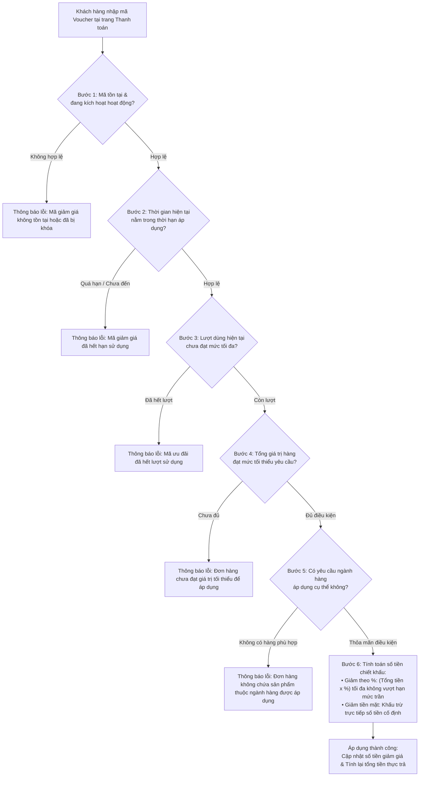

---

### 3.7. Phân hệ Quản lý Cấu hình & Đối soát Thanh toán (Payment Management)

#### Mục đích:
Quản lý thông tin tài khoản ngân hàng chuyển khoản VietQR, ví điện tử MoMo của siêu thị và đối soát giao dịch thanh toán trực tuyến.

#### Các quy trình con:
1. **Cấu hình Thông tin Nhận tiền**: Cài đặt thông tin tài khoản ngân hàng MB Bank (Số tài khoản, Chủ tài khoản, Cú pháp chuyển khoản chuẩn `MINIMART {Mã_Đơn}`), thông tin ví MoMo và tải ảnh mã QR cố định.
2. **Bật / Tắt Phương thức Thanh toán**: Quản trị viên linh hoạt tắt phương thức chuyển khoản khi ngân hàng bảo trì để tránh gián đoạn trải nghiệm của khách hàng.
3. **Đối soát Giao dịch Thanh toán Trực tuyến**:
   * Quản trị viên mở bảng theo dõi giao dịch thanh toán để kiểm tra danh sách các đơn hàng chuyển khoản chờ xác nhận.
   * **Duyệt thanh toán**: Khi tiền đã về tài khoản ngân hàng, quản trị viên bấm "Duyệt thanh toán" $\rightarrow$ Giao dịch chuyển sang "Đã thanh toán", đơn hàng tự động chuyển sang "Đã xác nhận" và sẵn sàng điều phối giao hàng.
   * **Từ chối thanh toán**: Nếu sau thời gian chờ khách không chuyển tiền hoặc chuyển sai số tiền, quản trị viên bấm "Từ chối thanh toán" $\rightarrow$ Giao dịch chuyển sang "Thất bại", đơn hàng tự động chuyển sang "Đã hủy", hệ thống tự động hoàn trả tồn kho và mã giảm giá.

#### Sơ đồ Mermaid:
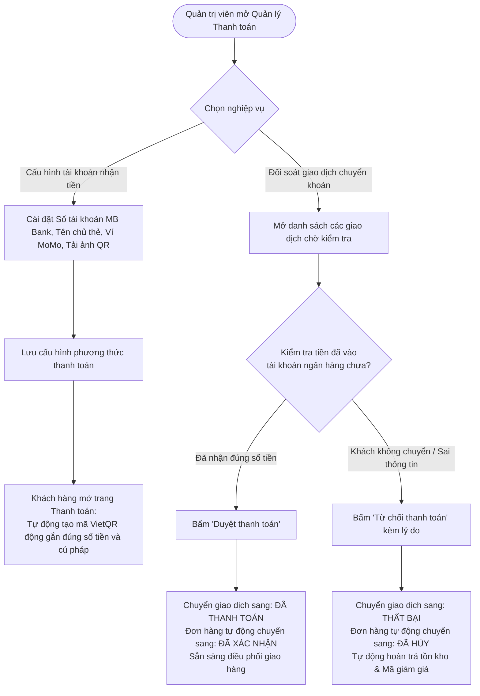

---

### 3.8. Phân hệ Quản lý Đánh giá & Phản hồi Khách hàng (Review Management)

#### Mục đích:
Thu thập ý kiến đánh giá chất lượng sản phẩm từ khách hàng đã mua và kiểm duyệt nội dung hiển thị công khai.

#### Các quy trình con:
1. **Khách hàng Gửi Đánh giá**: Khách hàng mở trang chi tiết sản phẩm đã mua, chọn số sao đánh giá (1 đến 5 sao) và viết nhận xét thực tế.
2. **Kiểm duyệt Đánh giá (Admin Moderation)**:
   * Đánh giá mới tạo mặc định ở trạng thái **Chờ duyệt** để phòng chống nội dung quảng cáo rác hoặc từ ngữ vi phạm tiêu chuẩn cộng đồng.
   * Quản trị viên kiểm tra tại trang quản lý đánh giá: bấm "Duyệt" để công khai hiển thị trên trang sản phẩm hoặc bấm "Xóa" nếu đánh giá sai lệch, phản cảm.
3. **Cập nhật Điểm Đánh giá Trung bình**: Hệ thống tự động tính toán lại điểm sao trung bình của sản phẩm dựa trên các đánh giá đã được duyệt công khai.

#### Sơ đồ Mermaid:
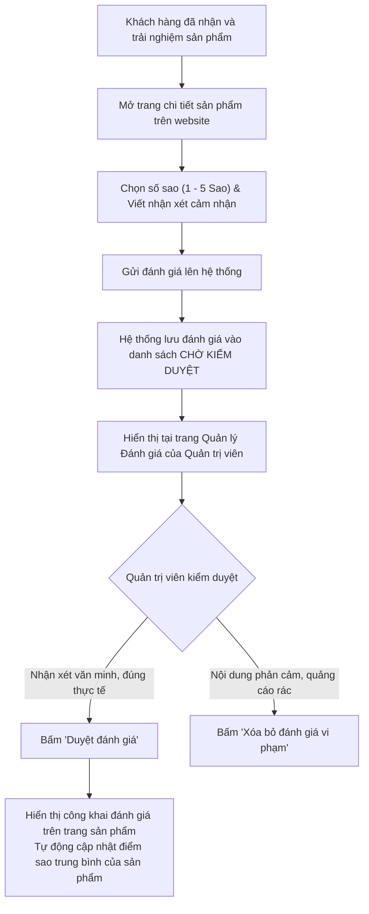

---

### 3.9. Phân hệ Hỗ trợ Trực tuyến & Trợ lý Ảo Thông minh (Support & AI Bot)

#### Mục đích:
Hỗ trợ giải đáp thắc mắc của khách hàng 24/7 về giá cả, vị trí sản phẩm, trạng thái giao hàng và tiếp nhận khiếu nại chất lượng dịch vụ.

#### Các quy trình con:
1. **Tư vấn tự động bằng Trợ lý ảo AI (Chatbot)**:
   * Khách bấm vào biểu tượng Chatbot tại góc màn hình.
   * Khách nhập câu hỏi (ví dụ: "Sản phẩm nào đang rẻ nhất?", "Có rau sạch không?", "Hôm nay có khuyến mãi gì?").
   * Trợ lý ảo sử dụng mô hình AI kết hợp dữ liệu sản phẩm thực tế trong siêu thị để phản hồi ngắn gọn, thân thiện và chính xác cho khách.
2. **Gửi Phản hồi / Hỗ trợ Trực tiếp (Customer Messaging)**:
   * Khách hàng gửi tin nhắn yêu cầu hỗ trợ hoặc góp ý đến siêu thị.
   * Hệ thống tạo cuộc hội thoại mới và đánh dấu thông báo chưa đọc cho Quản trị viên.
   * Quản trị viên mở bảng tin nhắn hỗ trợ, đọc nội dung và gửi phản hồi trả lời trực tiếp cho khách hàng.

#### Sơ đồ Mermaid:
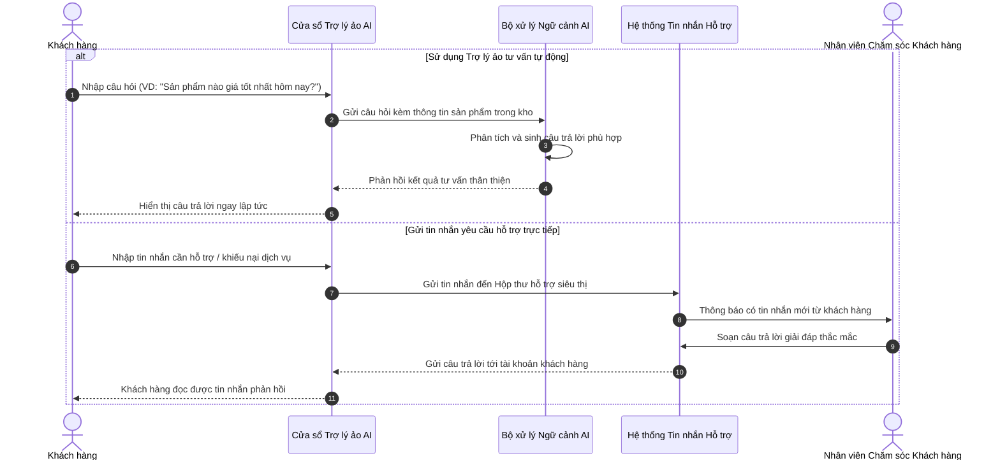

---

### 3.10. Phân hệ Quản lý Tài khoản & Phân quyền Người dùng (User & Security)

#### Mục đích:
Quản lý đăng ký, đăng nhập an toàn, phân quyền chặt chẽ theo vai trò và bảo vệ dữ liệu thông tin cá nhân của người dùng.

#### Các quy trình con:
1. **Đăng ký tài khoản truyền thống**: Khách hàng nhập Tên đăng nhập, Email, Mật khẩu, Họ tên và SĐT. Mật khẩu được mã hóa an toàn bằng thuật toán BCrypt trước khi lưu trữ.
2. **Đăng nhập truyền thống**: Khách đăng nhập bằng Tên đăng nhập/Email và Mật khẩu. Khi thông tin khớp, hệ thống cấp phát chuỗi mã thông báo bảo mật (JWT Token) để xác thực các phiên thao tác tiếp theo.
3. **Đăng nhập nhanh bằng Mạng xã hội (Google / Facebook OAuth2)**:
   * Khách chọn "Đăng nhập với Google". Hệ thống chuyển hướng sang cổng bảo mật của Google.
   * Khách đồng ý cấp quyền $\rightarrow$ Google gửi lại thông tin hồ sơ (Email, Tên, Ảnh đại diện).
   * Hệ thống tự động tạo tài khoản mới (nếu đăng nhập lần đầu) hoặc liên kết với tài khoản có sẵn và cấp mã thông báo bảo mật đăng nhập ngay.
4. **Quản trị Tài khoản & Phân quyền (Admin)**:
   * Quản trị viên xem danh sách người dùng, lọc theo vai trò (Khách hàng, Shipper, Quản trị viên).
   * Khóa hoặc mở khóa tài khoản người dùng vi phạm chính sách (tài khoản Quản trị viên chính được bảo vệ, cấm khóa).
   * Cập nhật thông tin cá nhân và quản lý sổ địa chỉ giao hàng nhận hàng.

#### Sơ đồ Mermaid:
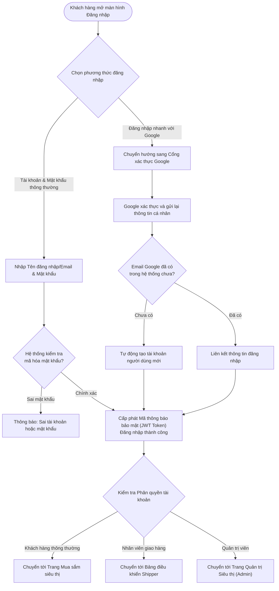

---

### 3.11. Phân hệ Báo cáo Thống kê & Phân tích Hoạt động Kinh doanh (Analytics & Reports)

#### Mục đích:
Cung cấp số liệu tài chính trực quan, đo lường tốc độ bán hàng, đánh giá năng suất giao hàng và thống kê tổn thất vốn do hàng hóa hết hạn để ban quản lý đưa ra quyết định kịp thời.

#### Các quy trình con:
1. **Tổng quan Chỉ số Hoạt động (Dashboard KPI)**:
   * Tổng doanh thu thực tế thu về từ các đơn hàng đã hoàn tất.
   * Tổng số đơn hàng đã phục vụ thành công.
   * Tổng số lượng khách hàng đăng ký thành viên.
   * Tổng số danh mục sản phẩm đang kinh doanh.
2. **Phân tích Doanh thu theo Chu kỳ Thời gian**:
   * Biểu đồ đường thể hiện doanh thu lũy kế theo từng tháng/ngày giúp so sánh tốc độ tăng trưởng kinh doanh.
3. **Phân bổ Cơ cấu Trạng thái Đơn hàng**:
   * Biểu đồ tròn thể hiện tỷ lệ phần trăm giữa đơn thành công, đơn đang giao, đơn hủy và đơn giao thất bại để đánh giá chất lượng phục vụ.
4. **Báo cáo Hiệu suất Giao hàng của Shipper**:
   * Bảng thống kê chi tiết cho từng nhân viên giao hàng: Số đơn được phân bổ, Số đơn giao thành công, Số đơn giao thất bại, Tỷ lệ giao đạt chuẩn (%) và Tổng số tiền mặt COD đang thu hộ.
5. **Báo cáo Tổn thất Lô hàng Hết hạn dùng**:
   * Thống kê toàn bộ các lô hàng quá hạn đã bị xuất hủy: Tên mặt hàng, Mã số lô, Số lượng hư hỏng và Tổng số tiền vốn bị thiệt hại để điều chỉnh kế hoạch nhập hàng lần sau.

#### Sơ đồ Mermaid:
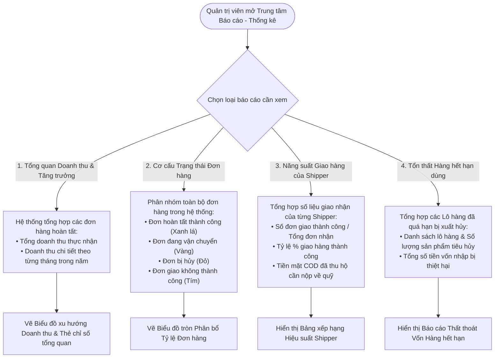

---

## TỔNG KẾT DANH MỤC CÁC PHÂN HỆ VÀ TRÁCH NHIỆM

| STT | Phân hệ nghiệp vụ | Trách nhiệm chính trong hệ thống | Đối tượng tương tác chính |
| :---: | :--- | :--- | :--- |
| **1** | **Mua sắm & Giỏ hàng** | Khám phá sản phẩm, kiểm tra tồn kho khả dụng tức thời, quản lý mặt hàng trong giỏ hàng. | Khách hàng |
| **2** | **Đặt hàng & Xử lý đơn** | Tạo đơn hàng, khấu trừ chiết khấu hội viên và voucher, trừ kho FIFO theo lô hạn dùng, duyệt đơn. | Khách hàng, Quản trị viên |
| **3** | **Điều phối & Giao hàng** | Tự động phân bổ đơn theo địa bàn quận huyện (Tân Phú, Tân Bình, Quận 12), giao hàng, thu tiền COD. | Quản trị viên, Shipper |
| **4** | **Quản lý Lô & Hạn dùng** | Theo dõi hạn sử dụng, xả kho cận date giá ưu đãi, khóa cấm bán và xuất hủy hàng hết hạn. | Quản lý kho |
| **5** | **Nhập kho & Kiểm định QC** | Lập phiếu nhập từ nhà cung cấp, kiểm định chất lượng đạt/lỗi, tự động tạo lô hàng mới và tăng tồn kho. | Quản lý kho, Thủ kho |
| **6** | **Thương hiệu & Ngành hàng**| Phân loại hàng hóa theo cây danh mục, quản lý nhãn hiệu đối tác kinh doanh. | Quản trị viên, Khách hàng |
| **7** | **Khuyến mãi & Mã giảm giá**| Tạo chiến dịch ưu đãi, kiểm tra 6 tiêu chí hợp lệ khi áp dụng voucher, quản lý số lượt sử dụng. | Quản trị viên, Khách hàng |
| **8** | **Khách hàng thân thiết** | Tích lũy 1 điểm cho mỗi 100.000đ thanh toán, tự động nâng hạng thẻ (Đồng, Bạc, Vàng, Kim Cương). | Khách hàng |
| **9** | **Đánh giá & Phản hồi** | Khách hàng chấm điểm và viết nhận xét sản phẩm, quản trị viên kiểm duyệt nội dung công khai. | Khách hàng, Quản trị viên |
| **10**| **Hỗ trợ & Trợ lý ảo AI** | Trợ lý ảo AI tư vấn sản phẩm 24/7, tiếp nhận và phản hồi tin nhắn hỗ trợ trực tiếp giữa khách và admin. | Khách hàng, Quản trị viên |
| **11**| **Tài khoản & Bảo mật** | Đăng ký, đăng nhập bảo mật (BCrypt + JWT), đăng nhập Google OAuth2, phân quyền truy cập. | Toàn bộ người dùng |
| **12**| **Báo cáo & Thống kê** | Phân tích doanh thu, tỷ lệ đơn hàng, hiệu suất nhân viên giao hàng, báo cáo tổn thất vốn hàng hủy. | Quản trị viên, Ban quản lý |
