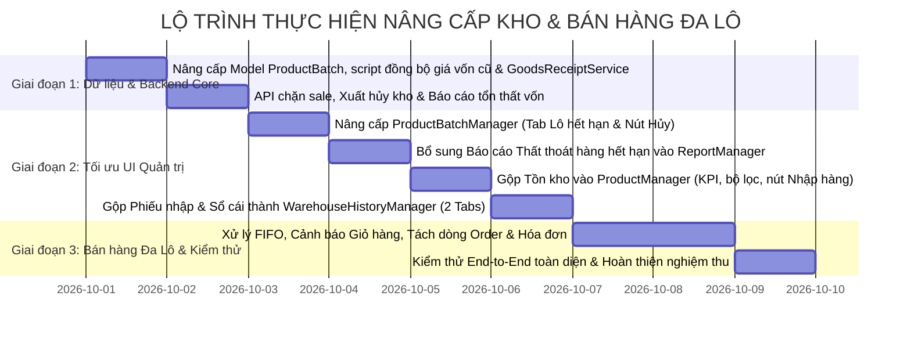

# KẾ HOẠCH TRIỂN KHAI NÂNG CẤP HỆ THỐNG KHO & BÁN HÀNG ĐA LÔ (PLAN 2.0)
**Dự án**: Siêu thị Mini Mart (Spring Boot & React Vite)  
**Workspace**: `d:\NAM CUOI\CNJAVA\Đồ ÁN CNJAVA`  
**Phiên bản**: 2.0 (Khắc phục triệt để lỗ hổng giá vốn lô cũ và chuẩn hóa đường dẫn)

---

## I. PHÂN TÍCH CHUYÊN SÂU 2 VẤN ĐỀ TRỌNG YẾU

### 1. Vấn đề Giá vốn (`importPrice`) của các lô cũ & Cơ chế Fallback 3 lớp

#### Hiện trạng & Rủi ro:
* Bảng `product_batches` hiện tại chỉ lưu trữ `batch_name`, `quantity`, `expiry_date`. Khi bổ sung trường `import_price` (kiểu `DECIMAL(18,2)` / `BigDecimal`), toàn bộ các bản ghi lô hàng đã tồn tại trong database sẽ có giá trị `importPrice = NULL`.
* Nếu không có cơ chế xử lý dữ liệu cũ:
  * Khi xuất hủy lô quá hạn hoặc hiển thị báo cáo thất thoát: phép tính `quantity * importPrice` sẽ gặp lỗi `NullPointerException` trong Java hoặc trả về `NULL` / `0đ` sai lệch với thực tế.
  * Thủ kho xem danh sách lô hết hạn không thấy được số vốn đang bị chôn/thiệt hại.

#### Giải pháp kỹ thuật hoàn chỉnh (Cơ chế 3 lớp Fallback):
1. **Lớp 1 - Khai thác quan hệ chứng từ (`GoodsReceiptItem`)**:
   * Kiểm tra trong database, các lô hàng cũ đều có liên kết khóa ngoại `goods_receipt_id` tới bảng `goods_receipt`. Bảng `goods_receipt_items` đã lưu sẵn `import_price` chính xác của từng sản phẩm trong đợt nhập đó.
   * Chạy câu lệnh SQL đồng bộ dữ liệu ban đầu:
     ```sql
     UPDATE pb
     SET pb.import_price = gri.import_price
     FROM dbo.product_batches pb
     INNER JOIN dbo.goods_receipt_items gri 
         ON pb.goods_receipt_id = gri.goods_receipt_id 
        AND pb.product_id = gri.product_id
     WHERE pb.import_price IS NULL;
     ```
2. **Lớp 2 - Fallback ước tính theo giá niêm yết**:
   * Đối với các lô tạo thủ công hoặc dữ liệu thử nghiệm không gắn phiếu nhập: Tự động gán giá vốn ước lượng bằng 70% giá bán niêm yết hiện tại của sản phẩm:
     ```sql
     UPDATE pb
     SET pb.import_price = CAST(p.price * 0.70 AS DECIMAL(18, 2))
     FROM dbo.product_batches pb
     INNER JOIN dbo.products p ON pb.product_id = p.id
     WHERE pb.import_price IS NULL;
     ```
3. **Lớp 3 - Bảo vệ mức Entity/Service trong Java**:
   * Trong entity `ProductBatch.java`, cung cấp hàm helper an toàn tuyệt đối:
     ```java
     public BigDecimal getEffectiveImportPrice() {
         if (this.importPrice != null && this.importPrice.compareTo(BigDecimal.ZERO) > 0) {
             return this.importPrice;
         }
         if (this.product != null && this.product.getPrice() != null) {
             return this.product.getPrice().multiply(BigDecimal.valueOf(0.70)).setScale(0, RoundingMode.HALF_UP);
         }
         return BigDecimal.ZERO;
     }
     ```
   * Khi duyệt phiếu nhập hàng mới trong `GoodsReceiptService.java`: Gán trực tiếp `batch.setImportPrice(item.getImportPrice())` để các lô mới 100% luôn có giá nhập chuẩn.

---

### 2. Chuẩn hóa đường dẫn hệ thống (Path Standardization)

#### Hiện trạng:
* Trong `PLAN.md` cũ, các liên kết tài liệu bị trỏ sai sang thư mục giả định `DOAN_CNJAVA_MINI_MARKET-main`.
* Khi lập trình viên nhấp vào liên kết trên IDE (VS Code, IntelliJ) hoặc mở tài liệu, liên kết bị lỗi `404 File Not Found`. Ký tự có dấu tiếng Việt `Đồ ÁN CNJAVA` cũng cần được chuẩn hóa định dạng URI.

#### Giải pháp chuẩn hóa:
Toàn bộ kế hoạch được mapping chính xác theo thư mục gốc thực tế:  
**Root Path**: `d:\NAM CUOI\CNJAVA\Đồ ÁN CNJAVA\`  
**URL Encoded**: `file:///d:/NAM%20CUOI/CNJAVA/%C4%90%E1%BB%93%20%C3%81N%20CNJAVA/`

Mọi module được ghi kèm đường dẫn tương đối (Relative Path) chuẩn để thuận tiện tìm kiếm:
* Entity: `src/main/java/com/groceryshop/entity/ProductBatch.java`
* Services: `src/main/java/com/groceryshop/service/` (`ProductBatchService.java`, `GoodsReceiptService.java`, `OrderService.java`, `ReportService.java`)
* Controllers: `src/main/java/com/groceryshop/controller/`
* Frontend Admin: `frontend/src/pages/admin/` (`ProductBatchManager.jsx`, `ProductManager.jsx`, `WarehouseHistoryManager.jsx`, `ReportManager.jsx`)
* Frontend Client: `frontend/src/pages/` (`Cart.jsx`, `Checkout.jsx`)

---

## II. KIẾN TRÚC GIẢI PHÁP CHO 4 YÊU CẦU NGHIỆP VỤ

```
┌──────────────────────────────────────────────────────────────────────────────────────────────────┐
│                               KIẾN TRÚC TỔNG THỂ HỆ THỐNG MỚI                                    │
├────────────────────────────────┬────────────────────────────────┬────────────────────────────────┤
│ 1. LÔ QUÁ HẠN & BÁO CÁO VỐN    │ 2. GỘP TRANG KHO & SẢN PHẨM    │ 3. BÁN HÀNG ĐA LÔ (SALE/MỚI)   │
├────────────────────────────────┼────────────────────────────────┼────────────────────────────────┤
│ • Chặn nút Sale lô hết hạn     │ • Gộp Tồn kho vào Sản phẩm     │ • Giá Sale lưu theo từng Lô    │
│ • Tab "Lô hết hạn" (SL & Vốn)  │ • Thẻ KPI tồn kho ở Header     │ • Thuật toán FIFO phân bổ giá  │
│ • Xuất hủy trừ kho & ghi sổ    │ • Nút "+ Tạo phiếu nhập" nhanh │ • Cảnh báo thông minh tại Cart │
│ • Báo cáo tổn thất hàng hủy    │ • Gộp Phiếu nhập & Sổ cái kho  │ • Hóa đơn tách 2 dòng minh bạch│
└────────────────────────────────┴────────────────────────────────┴────────────────────────────────┘
```

### 1. Quản lý Lô Hết Hạn & Báo Cáo Tổn Thất Vốn
* **Backend**:
  * Thêm `importPrice`, `salePrice`, `status` vào `ProductBatch`.
  * Trong `ProductBatchService.applyClearanceSale()`: Ném lỗi `BadRequestException` nếu `expiryDate < LocalDate.now()`.
  * Bổ sung API `POST /api/admin/batches/{id}/dispose`: Trừ `batch.quantity = 0`, cập nhật `status = 'DISPOSED'`, giảm `currentStock` của `inventory`, ghi `inventory_ledger` loại `EXPIRED_DISPOSAL`.
  * API Báo cáo `GET /api/admin/reports/expired-batches`: Tổng hợp số lô hết hạn, tổng số lượng hủy, tổng vốn thiệt hại (`quantity * importPrice`).
* **Frontend**:
  * Tại `ProductBatchManager.jsx`: Thêm tab thứ 3 **"Lô hàng đã hết hạn"** (badge đỏ). Hiển thị: Mã lô, Sản phẩm, HSD, Số lượng tồn, Giá nhập vốn, Tổng thiệt hại vốn (`SL * Giá nhập`). Có nút **"Xuất hủy kho"**.
  * Ẩn hoàn toàn nút "Thiết lập Sale" với các lô đã quá hạn.
  * Tại `ReportManager.jsx`: Bổ sung Card KPI "Tổn thất hàng hết hạn" và bảng chi tiết có xuất CSV và In báo cáo.

### 2. Gộp Trang Tồn Kho vào Quản Lý Sản Phẩm
* Bỏ mục "Tồn kho" trên Sidebar `AdminLayout.jsx`. Redirect route `/admin/inventory` sang `/admin/products`.
* Nâng cấp `ProductManager.jsx`:
  * Thêm nút `+ Tạo phiếu nhập` màu xanh lá nổi bật trên thanh công cụ.
  * Thêm 3 thẻ KPI ở đầu trang: **Tổng lượng tồn kho**, **Mặt hàng sắp hết (`<= minStock`)**, **Mặt hàng hết tồn (`= 0`)**. Bấm vào thẻ để lọc nhanh danh sách.
  * Bộ lọc tồn kho: `Tất cả` | `Còn hàng` | `Sắp hết` | `Đã hết`.

### 3. Gộp Phiếu Nhập Kho & Sổ Cái Biến Động Kho
* Tạo trang hợp nhất `WarehouseHistoryManager.jsx` gồm 2 Tab:
  * **Tab 1: Phiếu nhập kho** (Kế thừa toàn bộ chức năng lập phiếu, duyệt phiếu, in phiếu của `GoodsReceiptManager.jsx`).
  * **Tab 2: Sổ cái biến động kho** (Kế thừa toàn bộ chức năng tra cứu biến động xuất/nhập/bán/hủy của `InventoryLedgerManager.jsx`).
* Cập nhật Sidebar: 2 mục cũ gộp thành 1 mục duy nhất: **"Lịch sử & Nhập kho"** (`/admin/warehouse-history`).

### 4. Nghiệp vụ Bán Hàng Đa Lô (Lô Cận Date Sale + Lô Mới Nguyên Giá)
* **Nguyên lý phân bổ**:
  * Khi khách mua số lượng $N$:
    * Duyệt các lô còn hạn (`expiryDate >= LocalDate.now()`) theo thứ tự FIFO (`expiryDate ASC`).
    * Nếu lô cận date đang sale có số lượng $Q_{sale} < N$: Phân bổ $Q_{sale}$ sản phẩm giá sale ưu đãi $P_{sale}$, và $(N - Q_{sale})$ sản phẩm theo giá gốc $P_{gốc}$ của lô tiếp theo.
* **Giao diện Khách hàng (`Cart.jsx` & `Checkout.jsx`)**:
  * Hiển thị thông báo nổi bật màu vàng:  
    `ℹ️ Lưu ý giá theo lô: Sản phẩm [Tên SP] có [Q_sale] sản phẩm lô cận date giá ưu đãi [P_sale]đ. [N - Q_sale] sản phẩm còn lại tính giá tiêu chuẩn [P_gốc]đ.`
  * Tách hiển thị 2 dòng giá rõ ràng trong giỏ và bảng tóm tắt.
* **Lưu đơn hàng & In hóa đơn (`OrderService.java` & `InvoiceManager.jsx`)**:
  * Tạo 2 bản ghi `OrderItem`:
    * Dòng 1: `[Tên SP] (Lô xả kho cận date - HSD: dd/MM/yyyy)` - Đơn giá sale
    * Dòng 2: `[Tên SP] (Lô tiêu chuẩn)` - Đơn giá gốc
  * Trừ kho chính xác từng lô (chỉ trừ vào các lô còn hạn sử dụng).
  * Hóa đơn in ra hiển thị rõ ràng 2 dòng sản phẩm, minh bạch 100%.

---

## III. BẢNG TỔNG HỢP CÁC ĐẦU VIỆC THỰC HIỆN

| STT | Phân hệ / File thực hiện | Nhiệm vụ kỹ thuật cụ thể | Kết quả đầu ra mong đợi |
| :---: | :--- | :--- | :--- |
| **1** | `ProductBatch.java`<br>`supermarket_db1.sql` | • Thêm cột `importPrice`, `salePrice`, `status`.<br>• Viết hàm fallback an toàn `getEffectiveImportPrice()`.<br>• Chạy script SQL đồng bộ giá vốn từ `goods_receipt_items` sang các lô cũ. | Các lô hàng cũ và mới đều có giá vốn; không xảy ra lỗi `NullPointerException`. |
| **2** | `GoodsReceiptService.java` | Khi hoàn thành phiếu nhập (`completeReceipt`), gán trực tiếp `batch.setImportPrice(item.getImportPrice())`. | Mọi lô hàng mới tạo ra đều tự động có giá nhập chuẩn xác. |
| **3** | `ProductBatchService.java`<br>`ProductBatchController.java` | • Chặn `applyClearanceSale` khi `expiryDate < now()`.<br>• Viết API `disposeBatch(batchId)` xuất hủy lô quá hạn, trừ kho và ghi sổ cái `EXPIRED_DISPOSAL`. | Ngăn chặn triệt để sale hàng quá hạn; có quy trình xuất hủy kho chuẩn mực. |
| **4** | `ProductBatchManager.jsx` | • Thêm Tab **"Lô hàng đã hết hạn"** kèm badge đỏ.<br>• Hiển thị cột Đơn giá nhập và Tổng vốn tổn thất.<br>• Ẩn nút "Thiết lập Sale", thêm nút "Xuất hủy kho". | Thủ kho nắm được tổng vốn thiệt hại và bấm hủy lô trực tiếp. |
| **5** | `ReportService.java`<br>`ReportController.java`<br>`ReportManager.jsx` | • Viết API `/api/admin/reports/expired-batches`.<br>• Thêm Card KPI "Tổn thất hàng hết hạn" và bảng chi tiết thất thoát theo lô (kèm In/Xuất CSV). | Quản trị viên theo dõi được bức tranh tài chính thất thoát do hàng tồn quá date. |
| **6** | `ProductManager.jsx`<br>`AdminLayout.jsx` | • Đưa nút `+ Tạo phiếu nhập` lên Header Sản phẩm.<br>• Thêm 3 thẻ KPI tồn kho và bộ lọc trạng thái tồn.<br>• Bỏ mục Tồn kho ở Sidebar, redirect `/admin/inventory` về `/admin/products`. | Tinh gọn menu quản trị; thủ kho thao tác tồn kho và nhập hàng ngay tại trang Sản phẩm. |
| **7** | `WarehouseHistoryManager.jsx`<br>`AdminLayout.jsx`<br>`App.jsx` | • Tạo trang mới gộp Phiếu nhập kho (Tab 1) và Sổ cái biến động kho (Tab 2).<br>• Gom 2 menu cũ trên Sidebar thành 1 mục: "Lịch sử & Nhập kho". | Giao diện quản trị kho tinh gọn, chuyên nghiệp, dễ tra cứu chứng từ. |
| **8** | `OrderService.java`<br>`Cart.jsx`<br>`Checkout.jsx`<br>`InvoiceManager.jsx` | • Thuật toán FIFO trừ kho chỉ lấy lô còn hạn (`expiryDate >= now()`).<br>• Hiển thị cảnh báo giá theo lô ở Giỏ hàng & Checkout.<br>• Tách 2 dòng `OrderItem` khi tạo đơn và in hóa đơn minh bạch. | Khách hàng hiểu rõ số tiền; trừ kho chính xác từng lô; hóa đơn minh bạch. |

---

## IV. TIẾN ĐỘ THỰC HIỆN DỰ KIẾN (ROADMAP)


